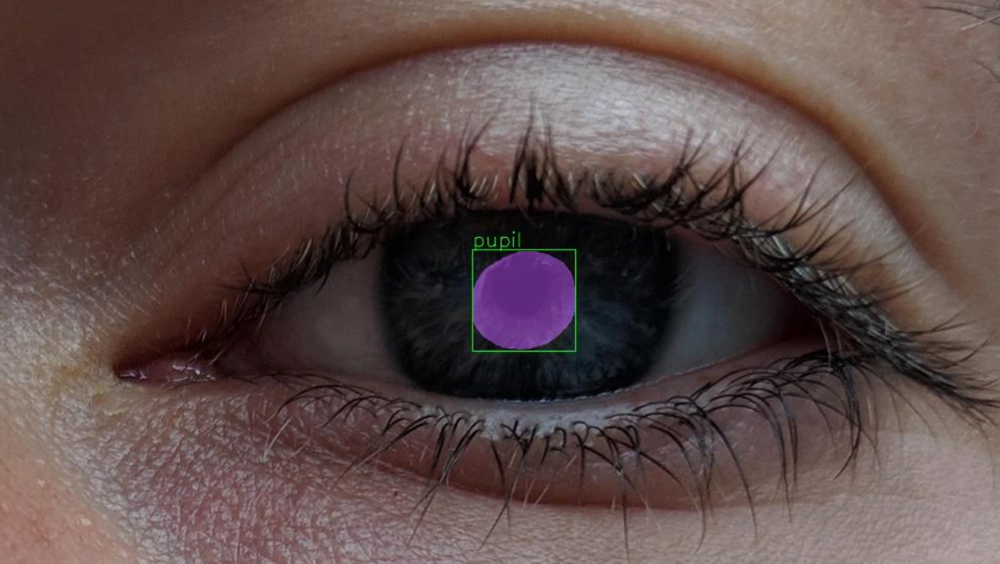
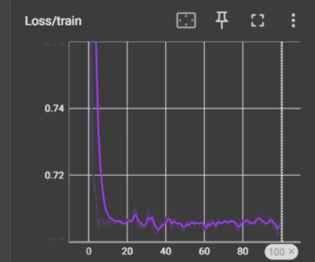
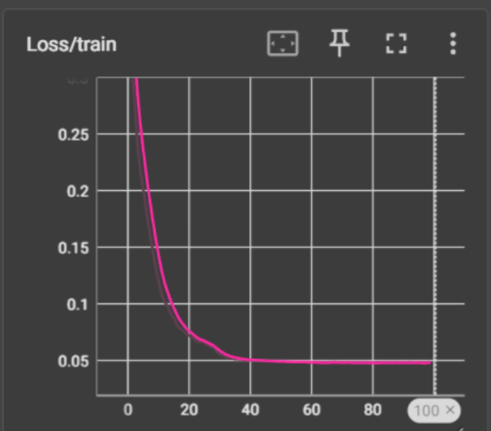

# Pupil Segmentation - Academic Project

<div style="text-align:center;">
    
</div>

## Dependencies

Build environment has Python 3.11 with conda

```bash
conda create -n "myenv" python=3.11
```

## Setup and Requirements

- `torch`: PyTorch library for deep learning computations.
- `OpenCV`: Open Source Computer Vision Library.
- `Numpy`: Fundamental package for scientific computing with Python.
- `scikit-learn`: Machine learning library for Python.
- `Pandas`: Data manipulation and analysis library for Python.

## Project Objective
The aim of the project was to develop a desktop application for assessing the pupillary light reflex in patients. The application was intended to support the diagnosis and monitoring of various neurological and ophthalmological disorders.

## Dataset

The dataset, available for download [here](https://sclera.fri.uni-lj.si/datasets.html), comprises 16,717 eye images sourced from 100 subjects. Among these images, 3,559 (representing 35 subjects) constitute the segmentation subset, meticulously annotated to delineate the sclera, iris, pupil, and periocular region.

Each image in the dataset is labeled as:
`<ID>_<phone><light>_<Eye><gaze>_<number>.jpg`

- `ID`: Subject ID (1–100)
- `phone`
	- **1**: Sony Xperia Z5 Compact
	- **2**: Apple iPhone 6s
	- **3**: Xiaomi Pocophone F1
- `light`
	- **i**: indoor
	- **n**: natural
	- **p**: poor
- `Eye`
	- **L**: left
	- **R**: right
- `gaze`
	- **l**: left
	- **r**: right
	- **s**: straight
	- **u**: up
- `number`
	- **1 or 2**: number of image in the current set
	- **bad**: deliberately unusable image (for quality control)

The multiclass segmentation masks are named the same as their corresponding original files, but with the '.png' extension. The colours in the masks correspond to the different regions, specifically:

- <span style="color:red">**Sclera**</span>: `RGB(255, 0, 0)`
- <span style="color:green">**Iris**</span>: `RGB(0, 255, 0)`
- <span style="color:blue">**Pupil**</span>: `RGB(0, 0, 255)`
- **Periocular**: `RGB(0, 0, 0)`

The dataset also comes bundled with a `data.csv` file, which contains extra information about the subjects in the dataset.

## Results Obtained
- Improvement in loss function and classification accuracy of regions of interest was observed.

- Transition to a new model resulted in longer network training time.
- The use of YOLO models yielded promising results.

- Classification was relatively weak, indicating the need for further refinement to improve the model's effectiveness.

## Project Execution
The project focused on iterative training of neural networks, experimenting with various architectures to minimize classification and segmentation errors. TensorBoard was used to meticulously track the training process.

Special attention was paid to parameters such as learning rates, activation functions, and layer sizes to optimize model performance. A targeted approach was adopted to achieve the most optimal results.

Additionally, the models were adapted to the specificity of the problem, especially the localization of the pupil in areas such as reflections or oval elements within the eyes. Experiments with YOLO models yielded positive results.

## Application Limitations
- Optimizing the project would require expanding the scope of available data and obtaining clearer images of the pupil.
- Models showed susceptibility to issues with pupil localization in areas such as reflections or oval elements within the eyes.
- Adjusting camera parameters during data collection would be beneficial for obtaining consistent images.

## Future Development Opportunities
- Expansion of the dataset and acquisition of better pupil images.
- Uniform standardization of the database to improve model efficiency.
- Continued experiments with the application of YOLO models.

## Functions for YOLOv5:
- Model Training:
	```bash
	python train.py --img 640 --epochs 300 --data custom.yaml --weights yolov5m.pt
	```
- Data
	```bash
	python detect_pupil.py --weights path/to/model/weights.pt --img 640 --conf 0.25 --source path/to/video.mp4 --save-csv
	```

- Diameter Data Analysis
	```bash
	python analyze.py "path/to/file.csv" 60 True
	```

# Bibliography

[1] Vitek, M., Bizjak, M., Peer, P., & Štruc, V. (2023). [IPAD: Iterative Pruning with Activation Deviation for Sclera Biometrics](https://doi.org/10.1016/J.JKSUCI.2023.101630). *Journal of King Saud University -- Computer and Information Sciences*, 35(8), 101630.

[2] Vitek, M., Das, A., Lucio, D. R., Zanlorensi, L. A., Menotti, D., Khiarak, J. N., ... & Štruc, V. (2023). [Exploring Bias in Sclera Segmentation Models: A Group Evaluation Approach](https://doi.org/10.1109/TIFS.2022.3216468). *IEEE Transactions on Information Forensics and Security (TIFS)*, 18, 190–205.

[3] Vitek, M., Rot, P., Štruc, V., & Peer, P. (2020). [A Comprehensive Investigation into Sclera Biometrics: A Novel Dataset and Performance Study](https://doi.org/10.1007/s00521-020-04782-1). *Neural Computing & Applications (NCAA)*, 32, 17941–17955.

[4] Vitek, M., Das, A., Pourcenoux, Y., Missler, A., Paumier, C., Das, S., ... & Štruc, V. (2020, October). [SSBC 2020: Sclera Segmentation Benchmarking Competition in the Mobile Environment](https://doi.org/10.1109/IJCB48548.2020.9304881). In *IEEE International Joint Conference on Biometrics (IJCB)* (pp. 1–10).

[5] Rot, P., Vitek, M., Grm, K., Emeršič, Ž., Peer, P., & Štruc, V. (2020). [Deep Sclera Segmentation and Recognition](https://doi.org/10.1007/978-3-030-27731-4_13). In *Handbook of Vascular Biometrics (HVB)* (pp. 395–432).
